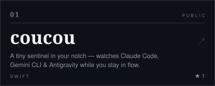
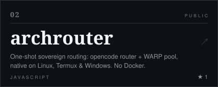
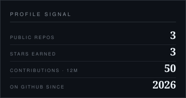
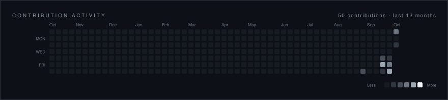
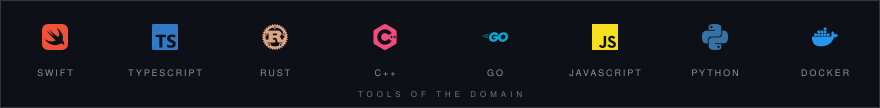
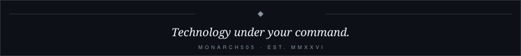

## 01 · DOCTRINE

Monarch builds software and systems designed to give people greater **ownership, control, and security** over the technology they depend on.

Technology should serve its owner — not become something its owner must surrender control to.

- **Own your system.** Understand it. Control it. Protect it.
- **Rule your tech.** Make it work for you, on your terms.

**Never build technology that unnecessarily takes control away from its owner.**

## 02 · WORKS

 

## 03 · SIGNAL

 

## 04 · STACK

Security · Infrastructure · Monitoring · Developer Tools · Enterprise Systems · Specialized Software.

Different systems. One philosophy. **More capability. More control. Less unnecessary complexity.**

